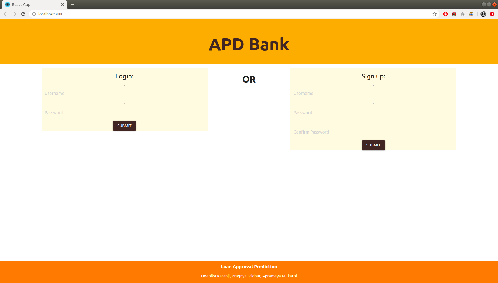
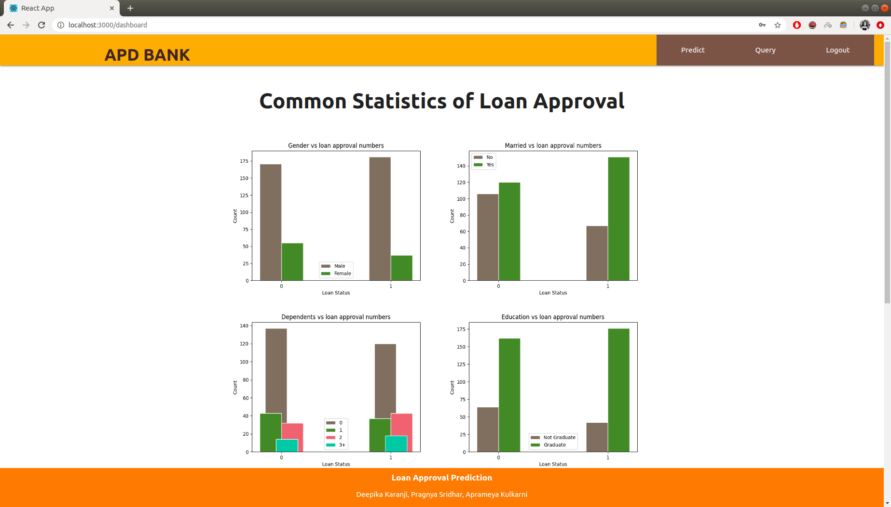
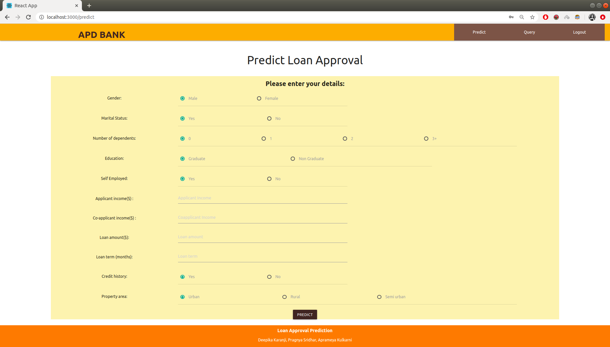
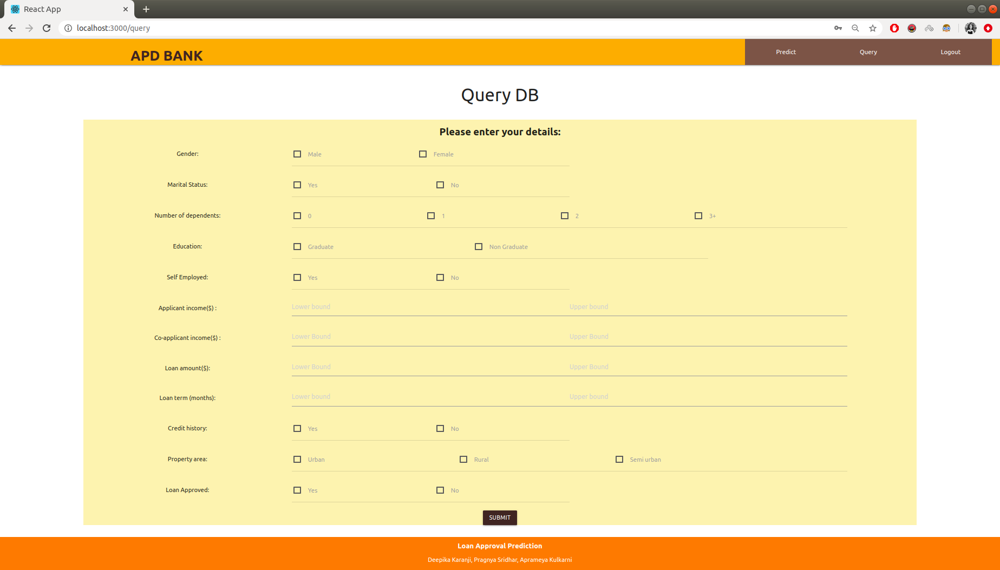
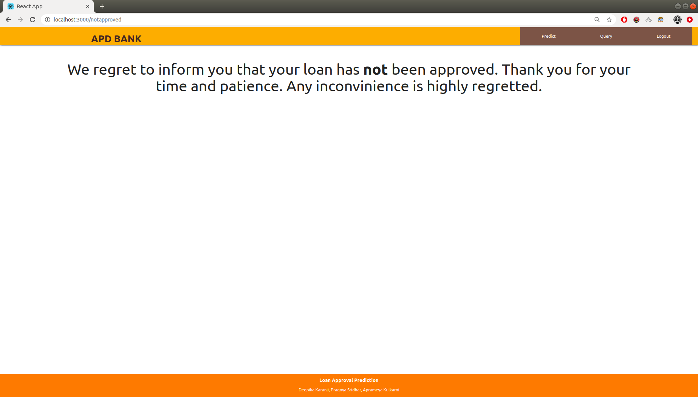
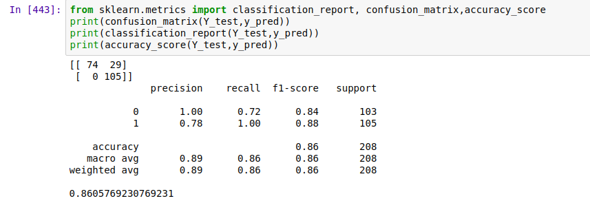

# Loan Approval Prediction

## Introduction

Loan eligibility is important for companies to determine if a loan applicant can be given the money.

Companies would want to automate the loan eligibility process (real time) based on customer details provided while filling online application form. These details are Gender, Marital Status, Education, Number of Dependents, Income, Loan Amount, Credit History and others. 

To automate this process, my team and I created a website that takes in customer information in loan application and identifies the customers segments, those are eligible for loan amount so that companies can specifically target these customers.

## Technologies used:

- Front End - React and Materialize CSS
- Backend - Flask application (Python)
- Database - SQLite
- Ajax patterns (Multistage and Periodic refresh), REST APIs
- Model used for prediction - Support vector classifier
- Setting Cookies

## Features Implemented

- Asynchronous XHR calls for form submissions (Queries and Prediction) and loading pages
- Multistage download to load and display graphs on dashboard
- Periodic refresh to update query page if database is updated
- CORS Handling
- REST APIs to handle and serve frontend requests
- Unit Tests for APIs with PyTest
- Performace Tests with Postman
- System Test with Selenium

## Intelligence

Dataset used - Dream Housing Finance company dataset
Preliminary data analysis:
Analyzing values assigned to columns through plots, we drew the some insights from the dataset. The graphs can be found in `backend/graphs` folder

**Preprocessing Data:**  
Input data needs to be pre-processed before we feed it to model.   
- Following things were taken care of:
    - Encoding Categorical Features
    - Handling missing values
- Model used: Support vector classifier
- Input: Gender, Marital Status, Dependents, Education, Self - Employed, Applicant Income, Co-Applicant Income, loan amount, loan term, credit history, property area
- Output: Loan Approved or Not Approved

## Instructions to run
1. `python3 backend/backend.py`
2. `cd frontend & npm start` (`npm install` may be needed)

## Results

### Website Frontend Screenshots

### Model Metrics 

